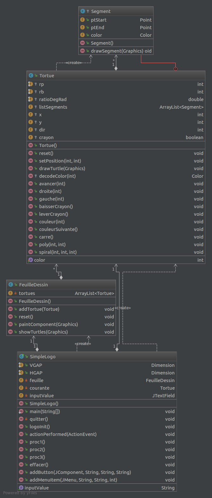
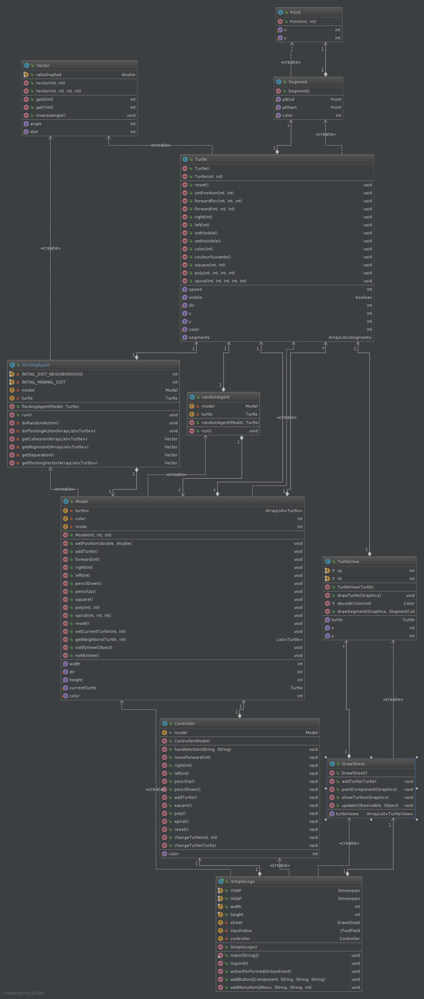

**GONDRAS Pierre-louis :**

**GORIA Théo :**

# Rapport TP4

## Question 1


En étudiant le code, nous pouvous nous rendre compte de plusieurs problème :
Déjà le code est en partie en français (ce qui ne se fait plus trop), de plus
certains nom de variable ou de fonctions n'ont pas de sens (proc1() ?). Pour finir les différentes
couches du pattern MVC sont totalement mélangés.

## Question 2
Nous avons redécoupé les différentes fonctionnalités comme ceci :
* Un package view qui contient tous les éléments chargé de l'affichage (tous
les composant Swing)
* Un package model qui regroupe les objets métier (les tortues par exemple)
qui effectus leurs actions sans s'occuper de l'affichage.
* Un package controler qui récupère les actions provenantes de la vue et les donne au model.
* Le modèle est observé par la vue pour qu'elle puisse se mettre à jour
à chaque changement de ce dernier.
* Pour finir nous avons conservé l'ancienne version de l'application dans un package old.

Voici notre UML après le refactoring :



Veuillez noter que ce diagiamme à été réalisé à la fin du TP.
Par conséquent certaines classes (flockingAgent et randomAgent) ont été ajoutées pour la suite du TP.

## Question 3
*Rien à rédiger*

## Question 4
Nous vons simplement ajouté un mouseListener à la feuille de dessin. De cette façon les cliques
souris sont intercepté par la vue puis passés au controller qui en informe le model.
Ce dernier peut alors regarder si ce clique correspond à une tortue et modifier sa tortue courante si c'est le cas,
puis informer la vue de ce changement.

Ajout du mouseListener :
```java
this.sheet.addMouseListener(new MouseAdapter() {
            public void mousePressed(MouseEvent e) {
            controller.changeTurtle(e.getX(),e.getY());
        }
    });
```

Changement de tortue courante dans le model :
```java
public void setCurrentTurtle(int X, int Y){
    for(Turtle turtle : turtles) {
        if (Math.sqrt(Math.pow(turtle.getX() - X, 2) + Math.pow(turtle.getY() - Y, 2)) < 10) {
            currentTurtle = turtle;
            break;
        }
    }
}
```
Nous prenons le première tortue qui correspond au clique souris.

## Question 5
Pour implémenter cette fonctionnalité nous avons créé une classe randomAgent.
Cette classe possède une tortue et génère, à interval de temps régulier, un mouvement
aléatoire pour cette dernière.
Elle implémente l'interface Runnable de façon à pouvoir être lancé dans un thread indépendant.
Il suffit alors d'assigner un randomAgent à chaque tortue que l'ont créé et de le lancer dans
un thread, quand l'application est lancé dans le bon mode pour que les tortues bougent aléatoirement.

## Question 6
De la même façon que la question précédente nous avons créé un flockingAgent qui simule
un comportement de flocking.

si la tortue à des voisins :
Cet agent créé trois vecteurs correspondant chacun à un comportement (cohésion, alignement et séparation),
puis les additionne (avec des coefficients) pour obtenir un mouvement.
Il génère un mouvement aléatoire sinon.

