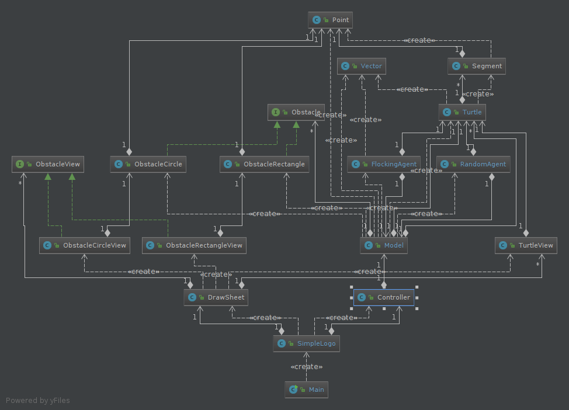

**GONDRAS Pierre-louis :**

**GORIA Théo :**

# Rapport TP4

## Question 1


En étudiant le code, nous pouvous nous rendre compte de plusieurs problème :
Déjà le code est en partie en français (ce qui ne se fait plus trop), de plus
certains nom de variable ou de fonctions n'ont pas de sens (proc1() ?). Pour finir les différentes
couches du pattern MVC sont totalement mélangés.

## Question 2
Nous avons redécoupé les différentes fonctionnalités comme ceci :
* Un package view qui contient tous les éléments chargé de l'affichage (tous
les composant Swing)
* Un package model qui regroupe les objets métier (les tortues par exemple)
qui effectus leurs actions sans s'occuper de l'affichage.
* Un package controler qui récupère les actions provenantes de la vue et les donne au model.
* Le modèle est observé par la vue pour qu'elle puisse se mettre à jour
à chaque changement de ce dernier.
* Pour finir nous avons conservé l'ancienne version de l'application dans un package old.

Voici notre UML après le refactoring :


Veuillez noter que ce diagiamme à été réalisé à la fin du TP.
Par conséquent certaines classes (flockingAgent et randomAgent) ont été ajoutées pour la suite du TP.

## Question 3
*Rien à rédiger*

## Question 4
Nous vons simplement ajouté un mouseListener à la feuille de dessin. De cette façon les cliques
souris sont interceptés par la vue puis passés au controller qui en informe le model.
Ce dernier peut alors regarder si ce clique correspond à une tortue et modifier sa tortue courante si c'est le cas,
puis informer la vue de ce changement.

Ajout du mouseListener :
```java
this.sheet.addMouseListener(new MouseAdapter() {
            public void mousePressed(MouseEvent e) {
            controller.changeTurtle(e.getX(),e.getY());
        }
    });
```

Changement de tortue courante dans le model :
```java
public void setCurrentTurtle(int X, int Y){
    for(Turtle turtle : turtles) {
        if (Math.sqrt(Math.pow(turtle.getX() - X, 2) + Math.pow(turtle.getY() - Y, 2)) < 10) {
            currentTurtle = turtle;
            break;
        }
    }
}
```
Nous prenons le première tortue qui correspond au clique souris.

## Question 5
Pour implémenter cette fonctionnalité nous avons créé une classe randomAgent.
Cette classe possède une tortue et génère, à interval de temps régulier, un mouvement
aléatoire pour cette dernière.
Elle implémente l'interface Runnable de façon à pouvoir être lancé dans un thread indépendant.
Il suffit alors d'assigner un randomAgent à chaque tortue que l'ont créée et de le lancer dans
un thread, quand l'application est lancé dans le bon mode, pour que les tortues bougent aléatoirement.

## Question 6
De la même façon que la question précédente nous avons créé un flockingAgent qui simule
un comportement de flocking.

si la tortue à des voisins :
Cet agent créé trois vecteurs correspondant chacun à un comportement (cohésion, alignement et séparation),
puis les additionne (avec des coefficients) pour obtenir un mouvement.
Il génère un mouvement aléatoire sinon.

## Projet

### UML
Avant de commencer voici un UML mis a jour de notre projet :



La classe model.Model est singleton puisqu'elle ne doit être instancié qu'une seule fois.

### Inertie
Nous avons ajouté de l'inertie aux tortues en ajoutant un vecteur correspondant à la vitesse
et à la direction actuelle de la tortue aux vecteurs du flocking.
Cette fonctionnalité permet de fluidifier les déplacement de la tortue en empêchant les mouvements trop brusques.
Nous avons donc légèrement modifié le comportement de flocking, quand la tortue n'as pas de voisin elle peut maintenant suivre ce vecteur (elle continuera alors à avancer dans la même direction) plutôt que de générer un vecteur aléatoire.

### Objectif
De le même manière que pour l'inertie nous avons ajouté un vecteur "objectif".
Quand le souris est sur la fenêtre ce vecteur est orienté en direction du pointeur de la souris.
Les tortues suivent donc la souris.
Quand la souris sort de la fenêtre ce vecteur devient nul et les tortues reprennent une activité de flocking classique.
Notre classe Vecteur prenant en comte l'environnement toroidale, le tortue arrive donc à trouver le plus court chemin pour arriver à l'objectif dans cet environnement particulier.

### Couleurs
Nous avons fait en sorte que les tortues ne voient que les autres tortues de la même couleur.
Cela permet de créer plusieurs groupes distincts de tortues.

Au lancement nous créons donc des tortues de quatres couleurs différentes.

### Affichage des traces
Nous avons ajouté la possibilité d'afficher les traces laissés par les tortues (qui correspondent aux 15 derniers segments tracés par une tortue).
Cela permet un affiche élégant du déplacement des tortues sans surcharger la fenêtre.
Afin de faciliter cet affichage nous avons ajouté des boutons permettant de lever et de baisser toutes les tortues en même temps
(Permettant d'activer ou de désactiver l'affichage des traces).

### Obstacles
Nous avons ajoutés des obstacles aux tortues.
Ces obstacles peuvent prendre la forme de cercles ou de rectangles, mais d'autres formes pouront êtres ajoutées facilement ultérieurement.

Les tortues ne pourront pas passer à travers les obstacles et sont obligée de le contourner.

### Champ de vision
Les tortues en mode flocking suivent les tortues qu'elles "voient".
Elles ne peuvent donc pas voir, ni suivre les tortues qui se trouvent derière elles.
Nous avons alors ajoutés un champ de vision aux tortues.

Pour déterminer si une tortue peut en voir sa voisine, nous créons un vecteur entre les deux tortues,
et si l'angle entre le vecteur de la direction de la tortue et ce vecteur est inferieur à son angle de champ de vision,
alors la tortue voit sa voisine.

Ce champ de vision utilisant notre class Vecteur, il prend en considération l'environnement toroidal,
ce qui leurs permet de na pas se perdrent quand elles arrivent aux bords de la fenêtre.
